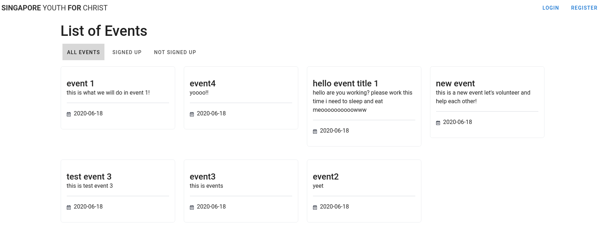
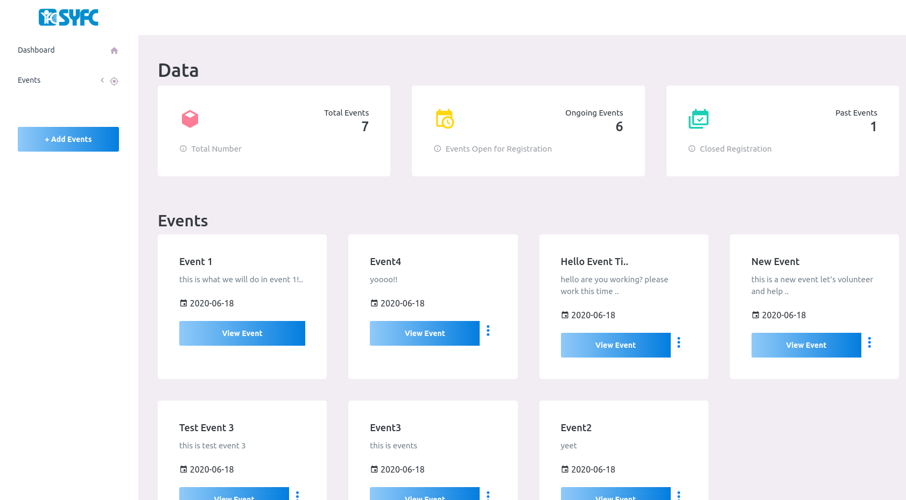

# PYTB20_SEED_SIG

This was the prototype and project we made while Participating in the prudential Young Trailblazers hackathon.  

The team consists of:  
1. Chuan Hao ([@chuanhao01](https://github.com/chuanhao01))
2. Jess ([@Blahblahlolhahaha](https://github.com/Blahblahlolhahaha))
3. David ([@David-The-Programmer](David-The-Programmer))
4. Heng Woon ([@Wooniety](https://github.com/Wooniety))
5. Silviana ([@silvianaho](https://github.com/silvianaho))

Our project main aim was to create a web app that eased the process for volunters to sign up and volunteer at events.  

You can find screenshots of the web app working below:  

How the client web app looked like:  

How the admin web app dashboard looks like:  

You can find the slides and our presentation below:  
[Slides](assets/PYTB20.pptx)